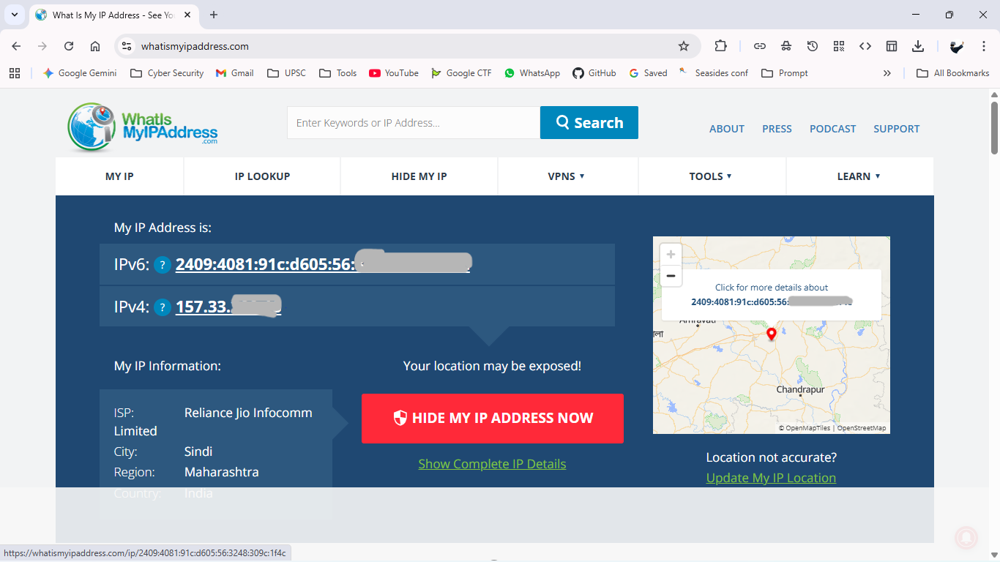
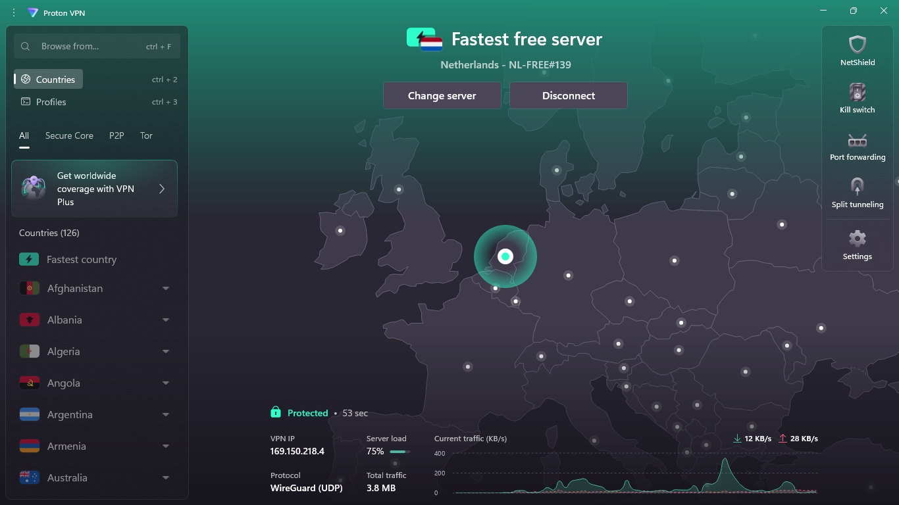
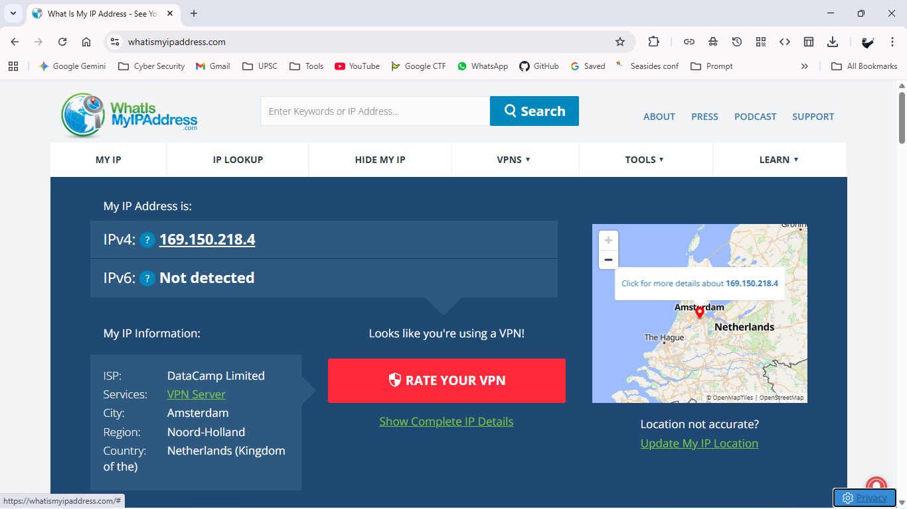

# Task 8: Understanding and Using a VPN

### **Objective**
The goal of this task was to understand how a VPN works to protect online privacy and to get hands-on experience setting one up.

### **Tools Used**
* **VPN Client:** ProtonVPN (Free Tier) 
* **IP Checker:** whatismyipaddress.com 

### **1. Process and Findings**

I followed the steps to see how a VPN changes my digital location and masks my real IP address.

#### **Step 1: Checking My Original IP Address**
First, I went to whatismyipaddress.com to check my real IP address without the VPN turned on. The website showed my location in Maharashtra, India, and my Internet Service Provider (ISP) as Reliance Jio.

#### **Step 2: Setting Up and Connecting the VPN**
I downloaded and installed ProtonVPN, a reputable free VPN service. After logging in, I connected to the fastest free server available, which was located in the Netherlands[cite: 161]. The app showed that I was "Protected" and that my traffic was now being routed through their server.

#### **Step 3: Verifying My New IP Address**
After connecting, I went back to whatismyipaddress.com. As expected, my IP address had completely changed. The website now showed my location as Amsterdam, Netherlands, and my ISP as DataCamp Limited, which is related to the VPN service. This confirms that the VPN was successfully hiding my real IP address.

 

### **2. VPN Benefits and Limitations**

From my research, I learned about the main pros and cons of using a VPN.

#### **Benefits of a VPN**
* **Privacy:** It hides your real IP address from websites, making it harder to track you online.
* **Security:** It encrypts your internet traffic, which is very important for keeping your data safe, especially when you're on public Wi-Fi.
* **Bypassing Restrictions:** It can help you access websites or content that might be blocked in your country or region.

#### **Limitations of a VPN**
* **Slower Speeds:** Routing your traffic through another server can sometimes slow down your internet connection.
* **Not Complete Anonymity:** A VPN doesn't make you 100% anonymous. Your VPN provider could still see your traffic, which is why choosing a trusted provider with a "no-logs" policy is important.
* **Can be Blocked:** Some websites, especially streaming services like Netflix, actively block connections from known VPNs.

### **3. Conclusion**

This task was a great introduction to VPNs. I learned how simple it is to set one up and instantly improve my online privacy. It’s a powerful tool for security, and I now understand both its benefits and its limitations much better.
